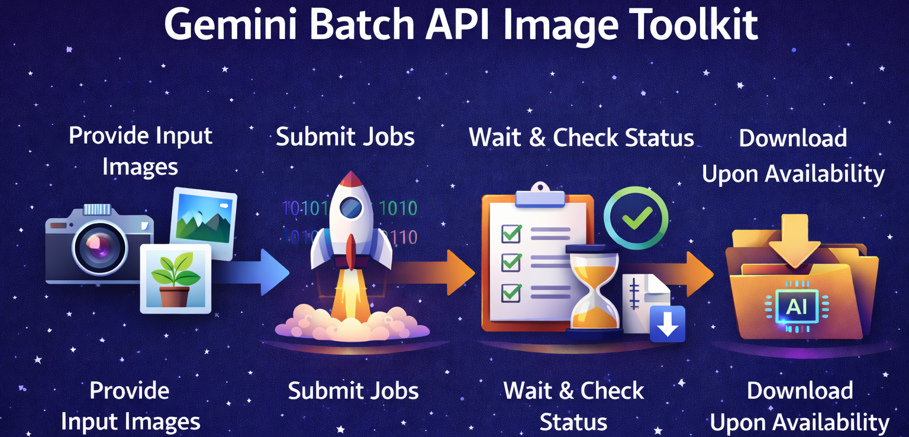

<p align="center">
  
</p>

# Gemini Batch Image Generator/Enhancer

A Python-based toolkit for processing large batches of images using Google's Gemini 3 Pro Image model (Batch API). This tool automates the workflow of uploading images, submitting batch enhancement jobs, and organizing the downloaded results.

## Features

- **Batch Processing:** Submit hundreds of images for enhancement in a single job.
- **Concurrent Uploads:** Fast, multi-threaded image uploading (default 10 threads).
- **Cost-Effective:** Uses the Gemini Batch API (50% cheaper than standard requests).
- **Organized Results:** Automatically creates dedicated folders for each job and mirrors your input folder structure in the output.
- **Job Management:** Scripts to check status (with color-coded output) and clean up resources.
- **Customizable:** Configure candidate count and image resolution per job.

## Prerequisites

- Python 3.9+
- A Google Cloud Project with the Gemini API enabled.
- A Gemini API Key.

## Installation

1.  **Clone the repository:**
    ```bash
    git clone https://github.com/your-username/gemini-batch-enhancer.git
    cd gemini-batch-enhancer
    ```

2.  **Create and activate a virtual environment:**
    ```bash
    python3 -m venv .venv
    source .venv/bin/activate  # On Windows: .venv\Scripts\activate
    ```

3.  **Install dependencies:**
    ```bash
    pip install -r requirements.txt
    ```

4.  **Configure Environment:**
    Create a `.env` file in the root directory and add your API key:
    ```env
    GEMINI_API_KEY=your_actual_api_key_here
    ```

## Usage

### 1. Setup
- Put your images in the `input_images/` folder.
- (Optional) You can use subfolders (e.g., `input_images/vacation/photo.jpg`), and the structure will be kept in the output.

### 2. Edit the Prompt
Open `submit_image_batch.py` and find the `prompt_text` variable (around line 66).
Change the text inside the quotes to tell the AI what to do with your images.

```python
# Example in submit_image_batch.py:
prompt_text = (
    "Describe this image in detail..."
)
```

### 3. Run the Batch
Start the job:
```bash
python submit_image_batch.py
```
Follow the on-screen prompts to set the job name and image size.

### 4. Check Progress
See if your job is done:
```bash
python check_jobs.py
```
Wait until the status says `SUCCEEDED`.

### 5. Download Images
Get your results:
```bash
python download_images.py
```
Your images will be saved in `generated_images/`.

### 6. Cleanup (Optional)
Cancel jobs or delete old files:
```bash
python cleanup_resources.py
```

## Output Behavior

- **File Extensions:** The generated images will retain the same file extension as their corresponding input images (e.g., a `.jpg` input results in a `.jpg` output, and a `.png` input results in a `.png` output).
- **Unprocessed Images:** Any images that fail processing or trigger safety filters are copied to an `unprocessed/` folder within the job's output directory, preserving their original filenames and extensions.

## Project Structure

- `submit_image_batch.py`: Main script to upload images and start a batch job.
- `check_jobs.py`: List all active and completed jobs.
- `download_images.py`: Download generated images from completed jobs.
- `cleanup_resources.py`: Utility to cancel jobs and delete storage files.
- `input_images/`: Directory for your source images.
- `generated_images/`: Directory where results are saved.

## Limitations

- **Model:** Currently optimized for `gemini-3-pro-image-preview`.
- **Multiple Candidates:** The current model preview does not support generating multiple images per prompt in batch mode.
- **Storage:** Files uploaded to Gemini storage expire after 48 hours.

## License

[MIT License](LICENSE)
